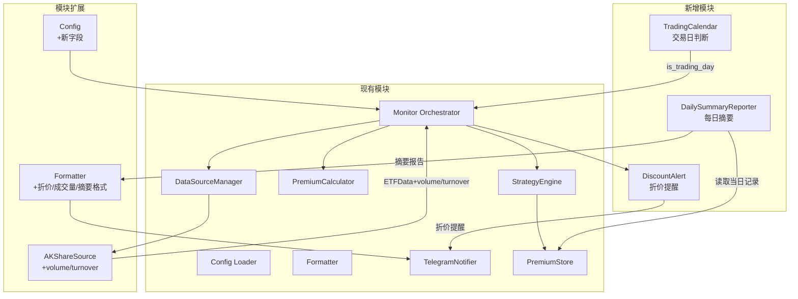

# Design Document: ETF Monitor Enhancements

## Overview

本设计文档描述 ETF 溢价监控系统的四项功能增强的技术实现方案：

1. **折价提醒** — 当 ETF 出现显著折价（溢价率为负且绝对值超过阈值）时，生成并推送折价买入提醒，帮助用户抓住低价买入机会。
2. **成交量与换手率监控** — 在溢价较高时展示成交量和换手率数据，辅助用户判断是否有套利资金流入。
3. **每日摘要报告** — 在每个交易日收盘后生成当日汇总报告，包含溢价率统计、买入/卖出建议触发情况。
4. **交易日历感知** — 自动识别非交易日（周末、法定节假日），跳过无意义的监控请求，同时支持周末调休工作日的特殊处理。

### 设计决策与理由

| 决策 | 理由 |
|------|------|
| 使用 `chinese_calendar` 库判断交易日 | 维护良好的开源库，覆盖 A 股法定节假日和调休，避免自行维护日历数据 |
| 折价提醒复用 Notifier 模块 | 与现有溢价提醒共享通知通道，降低复杂度 |
| 成交量/换手率仅在高溢价时展示 | 避免信息过载，仅在需要辅助判断时展示 |
| 每日摘要使用 APScheduler 定时触发 | 轻量级定时框架，无需引入独立进程 |
| 成交量/换手率字段加入 ETFData | 最小化数据模型变更，保持数据流一致性 |
| 摘要报告从 PremiumStore 读取历史数据 | 复用现有存储层，无需额外持久化 |
| 折价去重通过内存 set 实现 | 单次运行生命周期内有效，简单高效 |

## Architecture



### 数据流

1. **启动阶段**：`main.py` 调用 `TradingCalendar.is_trading_day()` 判断当前日期。非交易日（且无 `--force` 参数）时记录日志并退出。
2. **监控阶段**：`Monitor.run()` 遍历 ETF，`AKShareSource` 额外提取成交量和换手率字段。
3. **折价检测**：溢价率计算后，`DiscountAlert` 检查是否触发折价提醒条件，生成并推送提醒。
4. **成交量展示**：当溢价率 ≥ alert_threshold 时，将成交量/换手率附加到 MonitorResult。
5. **每日摘要**：收盘后定时（默认 15:30）由 `DailySummaryReporter` 从 PremiumStore 读取当日数据，生成摘要并推送。

## Components and Interfaces

### 1. TradingCalendar (`src/trading_calendar.py`)

负责判断指定日期是否为 A 股交易日。

```python
class TradingCalendar:
    """A 股交易日历，基于 chinese_calendar 库判断交易日。"""

    def is_trading_day(self, date: date | None = None) -> bool:
        """判断指定日期是否为交易日。
        
        Args:
            date: 待判断的日期，默认为今天（北京时间）
            
        Returns:
            True 表示交易日，False 表示非交易日
        """
        ...

    def _fallback_check(self, date: date) -> bool:
        """回退逻辑：仅排除周六和周日。"""
        ...
```

**关键行为**：
- 优先使用 `chinese_calendar.is_workday()` 判断
- 若 `chinese_calendar` 导入失败或调用异常，回退到仅排除周末的基础逻辑
- 回退时记录 WARNING 日志

### 2. DiscountAlert (`src/discount_alert.py`)

负责检测折价条件并生成折价买入提醒。

```python
@dataclass
class DiscountAlertResult:
    """折价提醒结果"""
    code: str
    name: str
    discount_rate: float    # 折价率（正数，如 1.5 表示折价 1.5%）
    price: float
    iopv: float

class DiscountAlert:
    """折价提醒检测器。"""

    def __init__(self, config: AppConfig) -> None:
        self._config = config
        self._alerted_codes: set[str] = set()  # 当次运行已提醒的 ETF 代码

    def check(self, code: str, name: str, premium_rate: float, 
              price: float, iopv: float, discount_threshold: float) -> DiscountAlertResult | None:
        """检查是否触发折价提醒。
        
        Args:
            code: ETF 代码
            name: ETF 名称
            premium_rate: 当前溢价率（负值表示折价）
            price: 当前价格
            iopv: 当前 IOPV
            discount_threshold: 折价触发阈值
            
        Returns:
            DiscountAlertResult 若触发提醒，否则 None
        """
        ...

    def reset(self) -> None:
        """重置已提醒记录（新监控周期开始时调用）。"""
        self._alerted_codes.clear()
```

**关键逻辑**：
- `premium_rate < 0` 且 `abs(premium_rate) >= discount_threshold` 时触发
- 同一运行周期内，每个 ETF 最多提醒一次（通过 `_alerted_codes` 去重）
- 返回 `DiscountAlertResult` 供 Formatter 和 Notifier 使用

### 3. DailySummaryReporter (`src/daily_summary.py`)

负责生成每日摘要报告。

```python
@dataclass
class ETFDailySummary:
    """单只 ETF 的每日摘要"""
    code: str
    name: str
    max_premium: float | None       # 当日最高溢价率
    min_premium: float | None       # 当日最低溢价率
    close_premium: float | None     # 收盘溢价率（当日最后一条记录）
    buy_triggered: bool             # 是否触发过买入建议
    sell_triggered: bool            # 是否触发过卖出建议
    status: str                     # "normal" | "no_data" | "read_error"

@dataclass
class DailySummaryReport:
    """每日摘要报告"""
    date: str                       # 报告日期 YYYY-MM-DD
    summaries: list[ETFDailySummary]

class DailySummaryReporter:
    """每日摘要报告生成器。"""

    def __init__(self, config: AppConfig, premium_store: PremiumStore) -> None:
        self._config = config
        self._premium_store = premium_store

    def generate(self, target_date: date | None = None) -> DailySummaryReport:
        """生成指定日期的摘要报告。
        
        Args:
            target_date: 目标日期，默认为今天（北京时间）
            
        Returns:
            DailySummaryReport 摘要报告对象
        """
        ...

    def _get_daily_records(self, code: str, target_date: date) -> list[PremiumRecord]:
        """从 PremiumStore 读取指定日期的所有记录。"""
        ...

    def _check_buy_triggered(self, records: list[PremiumRecord], etf_config: ETFConfig) -> bool:
        """判断当日是否有记录满足 premium_rules 买入条件。"""
        ...

    def _check_sell_triggered(self, records: list[PremiumRecord], etf_config: ETFConfig) -> bool:
        """判断当日是否有记录超过 sell_threshold。"""
        ...
```

**关键逻辑**：
- 从 PremiumStore 按日期筛选当日记录（北京时间 00:00:00 至 23:59:59）
- 无记录时标注 `status = "no_data"`
- 读取异常时标注 `status = "read_error"`，继续处理其余 ETF
- 买入触发判断：遍历当日记录，检查是否有 premium_rate 满足任一 premium_rule 的 max_premium 条件
- 卖出触发判断：检查是否有 premium_rate > sell_threshold

### 4. AKShareSource 扩展

在现有 `ETFData` 返回中增加成交量和换手率字段：

```python
@dataclass
class ETFData:
    """数据源返回的 ETF 原始数据"""
    code: str
    price: float
    iopv: float
    update_time: datetime
    source: str
    volume: float | None = None          # 成交量（手）
    turnover_rate: float | None = None   # 换手率（%）
```

`AKShareSource.fetch()` 扩展：
- 从 DataFrame 中提取 "成交量" 和 "换手率" 字段
- 若字段为空、NaN 或负数，设为 None 并记录 WARNING 日志
- 不影响主流程返回

### 5. 配置扩展

```python
@dataclass
class ETFConfig:
    # ... 现有字段 ...
    discount_threshold: float = 1.0    # 折价触发阈值 %，0.1-20.0

@dataclass
class AppConfig:
    # ... 现有字段 ...
    summary_time: str = "15:30"        # 摘要报告触发时间 HH:MM
```

config.yaml 新增字段示例：

```yaml
summary_time: "15:30"    # 摘要报告时间

etfs:
  - code: "513500"
    name: "博时标普500ETF"
    discount_threshold: 1.0   # 折价 1% 时提醒
    # ... 其他字段 ...
```

### 6. Formatter 扩展

新增格式化方法：

```python
def format_discount_alert_plain(alert: DiscountAlertResult) -> str:
    """格式化折价提醒纯文本。"""
    ...

def format_discount_alert_telegram(alert: DiscountAlertResult) -> str:
    """格式化折价提醒 Telegram 消息。"""
    ...

def format_volume_info_plain(volume: float | None, turnover_rate: float | None) -> str:
    """格式化成交量/换手率纯文本。
    成交量以万手为单位保留2位小数，换手率保留2位小数加%。
    None 时显示 N/A。"""
    ...

def format_daily_summary_plain(report: DailySummaryReport) -> str:
    """格式化每日摘要纯文本。"""
    ...

def format_daily_summary_telegram(report: DailySummaryReport) -> str:
    """格式化每日摘要 Telegram MarkdownV2。"""
    ...
```

### 7. Monitor 扩展

```python
class Monitor:
    def __init__(self, config: AppConfig) -> None:
        # ... 现有初始化 ...
        self._discount_alert = DiscountAlert(config)
        self._trading_calendar = TradingCalendar()

    def run(self) -> list[MonitorResult]:
        # 新增: 交易日判断（被 main.py 层面调用）
        # 新增: 折价检测逻辑
        # 新增: 成交量/换手率条件展示
        ...
```

### 8. CLI 扩展

```python
# src/main.py
parser.add_argument(
    "--force",
    action="store_true",
    default=False,
    help="强制运行，跳过交易日判断",
)
```

## Data Models

### 新增数据类

```python
# src/models.py 新增

@dataclass
class DiscountAlertResult:
    """折价提醒结果"""
    code: str               # ETF 代码
    name: str               # ETF 名称
    discount_rate: float    # 折价率（正数百分比，如 1.50）
    price: float            # 当前价格
    iopv: float             # 当前 IOPV

@dataclass
class ETFDailySummary:
    """单只 ETF 的每日摘要"""
    code: str
    name: str
    max_premium: float | None
    min_premium: float | None
    close_premium: float | None
    buy_triggered: bool
    sell_triggered: bool
    status: str             # "normal" | "no_data" | "read_error"

@dataclass
class DailySummaryReport:
    """每日摘要报告"""
    date: str               # YYYY-MM-DD
    summaries: list[ETFDailySummary]
```

### ETFData 扩展

```python
@dataclass
class ETFData:
    code: str
    price: float
    iopv: float
    update_time: datetime
    source: str
    volume: float | None = None          # 成交量（手），可为 None
    turnover_rate: float | None = None   # 换手率（%），可为 None
```

### MonitorResult 扩展

```python
@dataclass
class MonitorResult:
    # ... 现有字段 ...
    volume: float | None = None          # 成交量（手），仅高溢价时有值
    turnover_rate: float | None = None   # 换手率（%），仅高溢价时有值
```

### 配置 YAML 新增字段

```yaml
# 顶层新增
summary_time: "15:30"       # HH:MM 格式，默认 15:30

# ETF 条目新增
etfs:
  - code: "513500"
    discount_threshold: 1.0  # 0.1-20.0，默认 1.0
```


## Correctness Properties

*A property is a characteristic or behavior that should hold true across all valid executions of a system—essentially, a formal statement about what the system should do. Properties serve as the bridge between human-readable specifications and machine-verifiable correctness guarantees.*

### Property 1: 折价提醒条件正确性

*For any* ETF 溢价率 premium_rate 和折价阈值 discount_threshold，折价提醒生成当且仅当 premium_rate < 0 且 abs(premium_rate) >= discount_threshold。当 premium_rate >= 0 或 abs(premium_rate) < discount_threshold 时，不生成任何折价提醒。

**Validates: Requirements 1.1, 1.6**

### Property 2: 折价提醒内容完整性

*For any* 有效的折价提醒结果（DiscountAlertResult），格式化输出字符串必须包含 ETF 代码、ETF 名称、折价率（保留两位小数）、当前价格和 IOPV 这五项信息。

**Validates: Requirements 1.2**

### Property 3: 折价提醒去重（幂等性）

*For any* 单次监控周期内，对同一 ETF 代码连续多次调用折价检查（无论参数是否变化），最多生成一条折价提醒。第一次触发后的后续检查均返回 None。

**Validates: Requirements 1.7**

### Property 4: 成交量数据条件包含

*For any* premium_rate 和 alert_threshold 的组合，监控结果中包含成交量和换手率数据当且仅当 premium_rate >= alert_threshold。当 premium_rate < alert_threshold 时，结果中的 volume 和 turnover_rate 字段为 None。

**Validates: Requirements 2.2, 2.6**

### Property 5: 成交量/换手率格式化正确性

*For any* 有效的成交量值 volume（手），格式化输出应为 volume/10000 保留 2 位小数后附加 "万手" 单位。*For any* 有效的换手率值 turnover_rate，格式化输出应为保留 2 位小数后附加 "%" 符号。当值为 None 时，输出为 "N/A"。

**Validates: Requirements 2.3, 2.5**

### Property 6: 每日摘要聚合正确性

*For any* 非空的 PremiumRecord 列表（按时间戳排序），DailySummaryReporter 生成的摘要中：max_premium 等于列表中的最大值，min_premium 等于列表中的最小值，close_premium 等于列表中最后一条记录的值。buy_triggered 为 True 当且仅当存在至少一条记录的 premium_rate 满足该 ETF 任一 premium_rule 的 max_premium 上限。sell_triggered 为 True 当且仅当存在至少一条记录的 premium_rate > sell_threshold。

**Validates: Requirements 3.2**

### Property 7: 交易日历回退正确性

*For any* 日期，当 chinese_calendar 不可用时，TradingCalendar.is_trading_day() 回退逻辑返回 True 当且仅当该日期为周一至周五（weekday 0-4），返回 False 当且仅当该日期为周六或周日（weekday 5-6）。

**Validates: Requirements 4.3**

### Property 8: discount_threshold 配置验证

*For any* discount_threshold 数值，配置加载成功当且仅当值在 [0.1, 20.0] 范围内。超出范围的值应导致配置验证失败。

**Validates: Requirements 1.5**

## Error Handling

| 组件 | 失败场景 | 处理策略 |
|------|---------|---------|
| TradingCalendar | chinese_calendar 导入失败 | 回退到仅排除周末的基础逻辑，记录 WARNING 日志 |
| TradingCalendar | is_workday() 调用异常 | 同上，回退到周末排除逻辑 |
| DiscountAlert.check() | premium_rate 为 None | 跳过检查，返回 None |
| AKShareSource | 成交量/换手率字段为空/NaN/负数 | 设为 None，记录 WARNING 日志，不影响主流程 |
| DailySummaryReporter | PremiumStore 读取异常 | 标注该 ETF 为 "read_error"，继续处理其余 ETF |
| DailySummaryReporter | 当日无记录 | 标注该 ETF 为 "no_data"，跳过统计计算 |
| Notifier | Telegram 推送折价提醒失败 | 记录错误日志，返回 False，不中断监控 |
| Notifier | Telegram 推送摘要报告失败 | 记录错误日志，不重试 |
| Config | discount_threshold 超出范围 | 打印验证错误到 stderr，exit(1) |
| Config | summary_time 格式无效 | 打印验证错误到 stderr，exit(1) |

所有新模块遵循现有项目模式：错误在单个 ETF 级别被隔离，不会导致整体监控流程崩溃。

## Testing Strategy

### 单元测试 (pytest)

| 模块 | 测试重点 |
|------|---------|
| `trading_calendar` | is_trading_day 正确判断交易日/非交易日、回退逻辑、周末调休处理 |
| `discount_alert` | 触发条件判断、去重逻辑、reset 清除、边界值（恰好等于阈值） |
| `daily_summary` | 最高/最低/收盘计算、买入/卖出触发判断、空数据处理、异常处理 |
| `akshare_source (扩展)` | 成交量/换手率提取、无效值处理（NaN/空/负数） |
| `formatter (扩展)` | 折价提醒格式、成交量万手转换、摘要报告格式、N/A 显示 |
| `config (扩展)` | discount_threshold 默认值/范围验证、summary_time 格式验证 |
| `monitor (扩展)` | 折价检测流程、成交量条件展示、--force 参数 |

### 属性测试 (hypothesis)

位于 `tests/properties/`：

| 属性 | 生成策略 |
|------|---------|
| 折价提醒条件 | 生成随机 (premium_rate [-20, 20], discount_threshold [0.1, 20.0]) 对，验证 alert 生成 iff 条件满足 |
| 折价提醒完整性 | 生成随机 DiscountAlertResult（code, name, rate, price, iopv），验证格式化输出包含所有字段 |
| 折价去重 | 生成随机调用序列（1-10 次相同 code），验证最多产生 1 个 alert |
| 成交量条件包含 | 生成随机 (premium_rate, alert_threshold) 对，验证 volume 有值 iff premium_rate >= threshold |
| 成交量格式化 | 生成随机 volume (正浮点数) 和 turnover_rate (正浮点数)，验证输出格式正确 |
| 摘要聚合 | 生成随机 PremiumRecord 列表 (1-50 条)，验证 max/min/close 计算正确 |
| 交易日历回退 | 生成随机日期 (2020-2030 范围)，验证回退逻辑与 weekday 判断一致 |
| discount_threshold 验证 | 生成随机 float 值，验证范围检查正确 |

**属性测试配置**：
- 使用 `hypothesis` 库（已在 requirements.txt 中）
- 每个属性测试最少运行 100 次迭代
- 每个测试以注释标注对应的设计文档属性
- 标注格式：**Feature: etf-monitor-enhancements, Property {number}: {property_text}**

### 集成测试

- 端到端 Monitor.run() 配合 mock 数据源，验证：
  - 折价时正确生成提醒并推送
  - 高溢价时成交量/换手率出现在输出中
  - --force 参数正确跳过交易日判断
- DailySummaryReporter 配合真实 PremiumStore 文件验证摘要生成
- TradingCalendar 配合 chinese_calendar 库验证已知日期判断正确性
