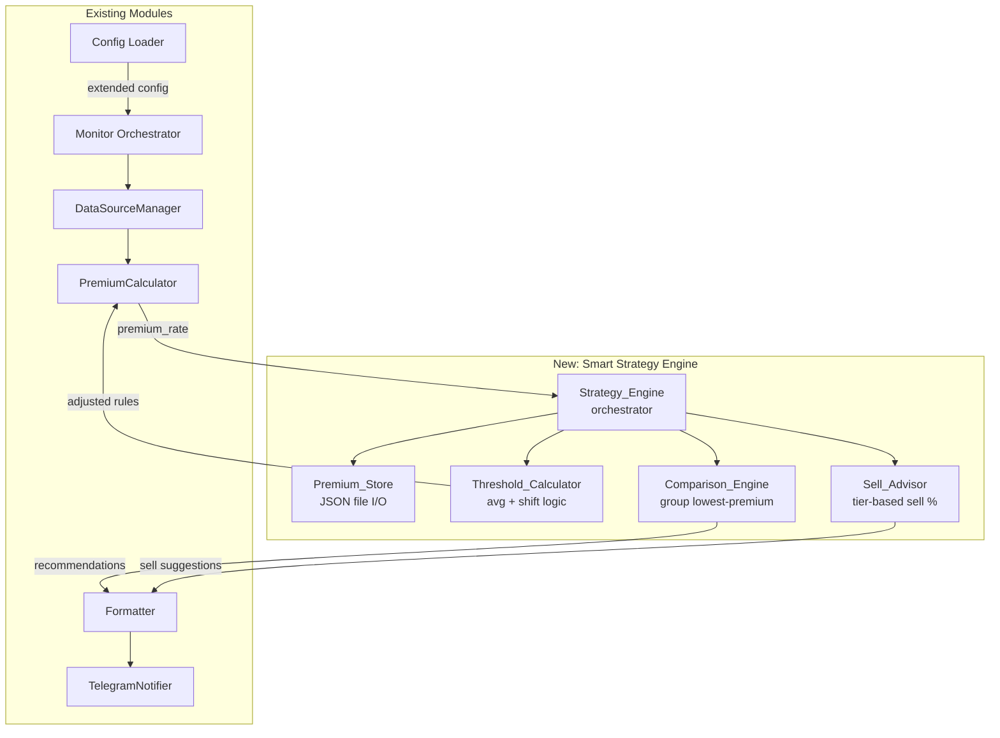

# Design Document: Smart Strategy Engine

## Overview

The Smart Strategy Engine extends the existing QDII ETF Premium Monitor with three intelligent capabilities:

1. **Dynamic Threshold Adjustment** — Shifts buy thresholds based on a rolling historical average premium, adapting to sustained high-premium environments so investors don't miss buying windows.
2. **Sell Suggestions** — Generates sell signals when a position is fully built and current premium exceeds a configurable sell threshold, with tiered sell percentages.
3. **Multi-ETF Comparison** — Groups ETFs by underlying index and recommends the lowest-premium option within each group.

The design preserves the existing stateless request-response pattern while introducing a lightweight file-based JSON persistence layer (Premium_Store) for historical premium tracking. All new features degrade gracefully: if persistence fails, the system falls back to static thresholds.

### Design Decisions & Rationale

| Decision | Rationale |
|----------|-----------|
| File-based JSON storage (no DB) | Render deployment compatibility; minimal ops overhead; data volume is tiny (~1 record/ETF/run × 30 days max) |
| Pure-function computation modules | Enables thorough property-based testing of threshold, sell, and comparison logic without mocks |
| Cap shift at 5.0pp | Prevents runaway threshold drift in extreme market conditions |
| 30-day auto-cleanup | Bounds storage without manual intervention |
| Configuration-order tiebreaker | Deterministic, no extra complexity for rare tie scenarios |

## Architecture



### Data Flow

1. **Monitor.run()** iterates ETFs, fetches data, calculates premium_rate (existing).
2. After premium calculation, **Strategy_Engine** is invoked:
   - Persists premium_rate → Premium_Store.
   - Calls Threshold_Calculator to get adjusted rules (used for `calculate_suggested_buy`).
   - After all ETFs processed, calls Sell_Advisor per ETF.
   - Calls Comparison_Engine across groups.
3. **Formatter** renders the full result including new sell and comparison sections.

## Components and Interfaces

### 1. Premium_Store (`src/premium_store.py`)

Responsible for persisting and querying historical premium records.

```python
@dataclass
class PremiumRecord:
    code: str
    premium_rate: float
    timestamp: datetime  # local system time, second precision

class PremiumStore:
    def __init__(self, data_dir: str = "data") -> None: ...
    def save(self, code: str, premium_rate: float, timestamp: datetime) -> None: ...
    def query(self, code: str, lookback_days: int) -> list[PremiumRecord]: ...
    def _cleanup(self, code: str) -> None: ...
```

- **File layout:** `{data_dir}/{code}.json` — one file per ETF.
- **save():** Appends record, deduplicates by timestamp (overwrite), calls `_cleanup()` to prune >30 days.
- **query():** Returns records within lookback window, sorted by timestamp ascending.
- **Error handling:** Catches `IOError`/`json.JSONDecodeError`, logs, and raises a custom `StoreError`.

### 2. Threshold_Calculator (`src/threshold_calculator.py`)

Pure-function module that computes adjusted thresholds.

```python
def calculate_adjusted_thresholds(
    rules: list[PremiumRule],
    historical_rates: list[float],
) -> list[PremiumRule]:
    """
    Returns new PremiumRule list with shifted max_premium values.
    min_ratio / max_ratio remain unchanged.
    """
    ...
```

Logic:
1. If `len(historical_rates) < 3` → return original rules unchanged.
2. Compute `avg = arithmetic_mean(historical_rates)`.
3. `baseline = min(rule.max_premium for rule in rules)` (first rule after sort by max_premium ascending).
4. If `avg <= baseline` → return original rules unchanged.
5. `shift = min(avg - baseline, 5.0)`, rounded to 2 decimal places.
6. Return new rules with each `max_premium += shift`.

### 3. Sell_Advisor (`src/sell_advisor.py`)

Pure-function module for sell signal generation.

```python
@dataclass
class SellSuggestion:
    code: str
    name: str
    premium_rate: float
    sell_percentage: float  # e.g. 0.15, 0.30, 0.50
    sell_amount: float      # bought_amount * sell_percentage

def evaluate_sell(
    code: str,
    name: str,
    premium_rate: float,
    bought_amount: float,
    target_amount: float,
    sell_threshold: float,
) -> SellSuggestion | None:
    """Returns SellSuggestion if conditions met, else None."""
    ...
```

Tier logic (excess = premium_rate - sell_threshold):
- `0 < excess <= 2.0` → 15%
- `2.0 < excess <= 5.0` → 30%
- `excess > 5.0` → 50%

No suggestion when `bought_amount < target_amount` or `premium_rate <= sell_threshold`.

### 4. Comparison_Engine (`src/comparison_engine.py`)

Pure-function module for multi-ETF comparison.

```python
@dataclass
class ComparisonResult:
    group_name: str
    recommended_code: str
    recommended_name: str
    recommended_premium: float
    alternatives: list[dict]  # [{code, name, premium_rate, diff}]

def compare_group(
    group_name: str,
    etf_premiums: list[dict],  # [{code, name, premium_rate}]
) -> ComparisonResult | None:
    """Returns recommendation for a group, or None if < 2 valid ETFs."""
    ...
```

Logic:
- Filter out entries where premium_rate is None (errored ETFs).
- If fewer than 2 valid → return None.
- Sort by premium_rate ascending, then by config order (stable sort preserves order for ties).
- Recommended = first in sorted list.
- Alternatives = remaining, each with `diff = alt.premium_rate - recommended.premium_rate`.

### 5. Strategy_Engine (`src/strategy_engine.py`)

Orchestrator that ties the new components together.

```python
class StrategyEngine:
    def __init__(self, config: AppConfig, premium_store: PremiumStore) -> None: ...
    
    def get_adjusted_rules(self, etf_config: ETFConfig, premium_rate: float) -> list[PremiumRule]:
        """Persist premium, compute and return adjusted rules."""
        ...
    
    def get_sell_suggestions(self, results: list[MonitorResult]) -> list[SellSuggestion]:
        """Evaluate sell conditions for all ETFs."""
        ...
    
    def get_comparisons(self, results: list[MonitorResult]) -> list[ComparisonResult]:
        """Run group comparison across all configured groups."""
        ...
```

### 6. Configuration Extension

New fields added to existing models:

```python
@dataclass
class ETFConfig:
    # ... existing fields ...
    sell_threshold: float = 8.0      # new: sell trigger threshold %
    group: str | None = None         # new: group identifier for comparison

@dataclass
class AppConfig:
    # ... existing fields ...
    lookback_days: int = 7           # new: rolling window for avg
    data_dir: str = "data"           # new: Premium_Store directory
```

### 7. Formatter Extension

New methods added to `src/formatter.py`:

```python
def format_sell_section(suggestions: list[SellSuggestion]) -> str: ...
def format_comparison_section(comparisons: list[ComparisonResult]) -> str: ...
```

Section order: buy suggestions → sell suggestions (⚠️ prefix) → group comparison.

## Data Models

### New Data Classes

```python
# src/models.py additions

@dataclass
class PremiumRecord:
    """Single historical premium observation."""
    code: str
    premium_rate: float       # decimal percentage, e.g. 2.35
    timestamp: datetime       # local time, second precision

@dataclass
class SellSuggestion:
    """A generated sell recommendation."""
    code: str
    name: str
    premium_rate: float       # current premium %
    sell_percentage: float    # 0.15, 0.30, or 0.50
    sell_amount: float        # bought_amount * sell_percentage

@dataclass
class ComparisonResult:
    """Recommendation for a single ETF group."""
    group_name: str
    recommended_code: str
    recommended_name: str
    recommended_premium: float
    alternatives: list[dict]  # [{code, name, premium_rate, diff}]

@dataclass 
class StrategyResult:
    """Aggregated strategy output for a single monitoring run."""
    sell_suggestions: list[SellSuggestion]
    comparisons: list[ComparisonResult]
    adjusted_rules_map: dict[str, list[PremiumRule]]  # code -> adjusted rules
```

### JSON Storage Schema (per ETF file)

```json
// data/513500.json
{
  "records": [
    {"premium_rate": 2.35, "timestamp": "2025-01-15T10:30:00"},
    {"premium_rate": 1.80, "timestamp": "2025-01-16T10:30:00"}
  ]
}
```

- `timestamp` stored as ISO 8601 string without timezone (local system time).
- File-level locking not required (single-process execution model).

### Extended Configuration YAML Schema

```yaml
# New optional fields
lookback_days: 7          # 1-90, default 7
data_dir: "data"          # directory path, default "data"

etfs:
  - code: "513500"
    name: "博时标普500ETF"
    target_amount: 100000
    bought_amount: 30000
    sell_threshold: 8.0   # 0.1-50.0, default 8.0
    group: "sp500"        # optional, non-empty string, max 64 chars
    premium_rules:
      - max_premium: 1.0
        min_ratio: 0.6
        max_ratio: 1.0
```


## Error Handling

| Component | Failure Mode | Handling Strategy |
|-----------|-------------|-------------------|
| Premium_Store.save() | IOError, permission denied | Log error, continue with static thresholds; monitoring result unaffected |
| Premium_Store.query() | IOError, corrupted JSON | Log error, return empty list → Threshold_Calculator uses static rules |
| Threshold_Calculator | Empty/insufficient history | Return original rules unchanged (< 3 records fallback) |
| Sell_Advisor | Invalid inputs (negative amounts) | Return None (no suggestion); log warning |
| Comparison_Engine | All ETFs in group errored | Return None for that group; skip section in output |
| Config loader | Invalid field types/ranges | Print specific field error to stderr, exit code 1 |
| data_dir creation | Directory doesn't exist | Auto-create on first write (os.makedirs with exist_ok=True) |

All new modules follow the existing project pattern: errors are contained per-ETF and never crash the overall monitoring pipeline.

## Correctness Properties

### Property 1: Threshold Shift Monotonicity

**Validates: Requirements 2.2**

For any set of historical rates where avg > baseline, every adjusted rule's max_premium SHALL be strictly greater than the original max_premium. The ordering relationship between rules is preserved (sorted by max_premium remains valid after shift).

### Property 2: Threshold Shift Cap Bound

**Validates: Requirements 2.5**

For any input, the shift applied to any rule's max_premium SHALL never exceed 5.0 percentage points. Formally: `∀ rule: adjusted.max_premium - original.max_premium ≤ 5.0`.

### Property 3: Sell Suggestion Exclusivity

**Validates: Requirements 3.1, 3.4, 3.7**

A sell suggestion is generated if and only if `bought_amount >= target_amount AND premium_rate > sell_threshold`. No other condition triggers a sell suggestion. `premium_rate == sell_threshold` does NOT trigger.

### Property 4: Sell Tier Completeness

**Validates: Requirements 3.3**

For any excess > 0 (where excess = premium_rate - sell_threshold), exactly one of the three tiers is selected. The tiers are exhaustive and mutually exclusive over (0, ∞).

### Property 5: Comparison Minimum Selection

**Validates: Requirements 4.1, 4.7**

Given a group with N ≥ 2 valid premium rates, the recommended ETF SHALL have a premium_rate ≤ all other ETFs in the group. In case of ties, the first in config order is selected.

### Property 6: Comparison Diff Non-Negativity

**Validates: Requirements 4.4**

For every alternative in a ComparisonResult, `diff = alt.premium_rate - recommended.premium_rate ≥ 0`.

### Property 7: Storage Idempotency

**Validates: Requirements 1.7**

Saving the same (code, premium_rate, timestamp) twice results in exactly one record in storage (deduplication by timestamp to the second).

### Property 8: Storage Bounded Growth

**Validates: Requirements 1.6**

After any write operation, no record with a timestamp older than 30 days from current system time exists in storage.

### Property 9: Ratio Preservation

**Validates: Requirements 2.7**

After threshold adjustment, for every rule: `adjusted.min_ratio == original.min_ratio AND adjusted.max_ratio == original.max_ratio`.

## Testing Strategy

### Unit Tests (pytest)

| Module | Test Focus |
|--------|-----------|
| `threshold_calculator` | Shift calculation with various averages, cap enforcement, < 3 records fallback, ratio preservation |
| `sell_advisor` | Tier boundaries (exact boundary values), exclusion when position not full, sell_threshold equality edge case |
| `comparison_engine` | Group sorting, tie-breaking, single-ETF skip, all-error skip, ungrouped ETF exclusion |
| `premium_store` | Save/query round-trip, deduplication, 30-day cleanup, corrupted file recovery |
| `config (extended)` | New field defaults, range validation, backward compatibility, empty group string handling |

### Property-Based Tests (hypothesis)

Located in `tests/properties/`:

| Property | Generator Strategy |
|----------|-------------------|
| Threshold shift cap | Generate random historical rates (floats 0-20), verify shift ≤ 5.0 |
| Threshold monotonicity | Generate random rules + rates, verify ordering preserved |
| Ratio preservation | Generate random rules + rates, verify min/max ratios unchanged |
| Sell exclusivity | Generate random (bought, target, premium, threshold) tuples, verify suggestion iff conditions met |
| Sell tier coverage | Generate random excess > 0, verify exactly one tier selected |
| Comparison minimum | Generate random group premium lists, verify recommended is minimum |
| Comparison diff non-neg | Generate random groups, verify all diffs ≥ 0 |
| Storage bounded growth | Generate sequences of saves with random timestamps, verify no record > 30 days old after write |

### Integration Tests

- End-to-end Monitor.run() with mocked data sources, verify:
  - Premium stored after each ETF processed
  - Adjusted thresholds used in buy calculation
  - Sell suggestions appear when conditions met
  - Group comparisons rendered in output
- Backward compatibility: run with old config.yaml (no new fields), verify identical behavior to pre-feature baseline
